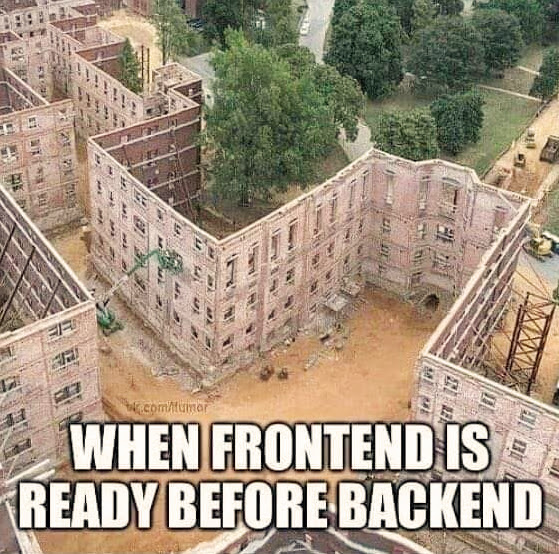

# How to do a FrontEnd ahead of BackEnd

[draft](https://docs.google.com/document/d/1V9X_ti29q5a_YaC0WnQourGNt2nXsIqijOGyzXWk8kY/edit#heading=h.i07jo4y412ce)

[GitHub GraphQL API](https://studio.apollographql.com/public/github/home?variant=current)
