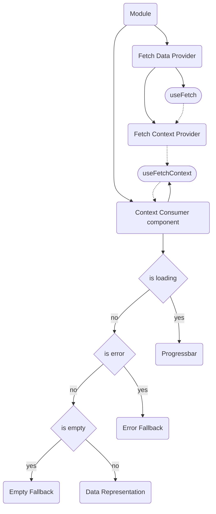

# Step 1

```sh
git checkout step-1
```

So, how we can fetch a data and render it?

Apollo Client library gives us several react hooks.

- [useQuery](https://www.apollographql.com/docs/react/api/react/hooks/#usequery) to fetch a data immediately.
- [useLazyQuery](https://www.apollographql.com/docs/react/api/react/hooks/#uselazyquery) to fetch a data on demand.
- [useMutation](https://www.apollographql.com/docs/react/api/react/hooks/#usemutation) to perform (surprise) mutations.

We want to show a repo information somehow. So we need to query it. Currently we do not have a backend yet. But we know that [the schema of query are going to be like this](https://studio.apollographql.com/public/github/variant/current/explorer?explorerURLState=N4IgJg9gxgrgtgUwHYBcQC4QEcYIE4CeABAGIIpQAWASggA4QAUAJEgIaLpEDKKeAlkgDmAQgA0RZhADuSfF14Dh4yQBs2wmGyEIAzlwCSqIgF4iAVgCURYAB0ktvvQi7%2BKCIUbtOk7wgkycnhcUrL41nYOKI78YPaOjn7x0SgweKrJjpQQiHTaCACq6ZkoYHpQAnQo-BAOUY5luhX8VTVIABIAKgCyADIlFQhsKAhgAILR9Sjqmvm6jABm-Hi6KCEzQlo6uhEliRCNNnspsceJHAhnFBCqHscAviWPU6r8UMi6CEYLEEdTMXF-igkkC0hkps8Eu4wng-lCAcdbkJBMc2AA3YZsPBFcFQyEoZ7PEBiEAYgRsABGqj0GBAkSIRFsICSGEZIApbCgAGtkGBqbpdABaNgMVS3QVQV7IaLE%2BwMpmBfBMrhMikQWoENhMsRytkbLZ6ZUWez3ED3IA) and the response like at the right panel.

Yes, I know, looks weird. BE is already there. But usually FE and BE teams can agreed on some contract before implementation starts. So, imagine we do not have real grapqhql service implemented, but we have a schema and response it will support.

Let’s go to the code and see what we can do with this information.

- Here is [the query schema file](https://github.com/boonya/backendless-apollo-client/blob/step-1/src/providers/FetchRepo/FetchRepo.gql
).
- Here is [the file of response example](https://github.com/boonya/backendless-apollo-client/blob/step-1/src/providers/FetchRepo/__response__/sample.json
).
- [The hook](https://github.com/boonya/backendless-apollo-client/blob/step-1/src/providers/FetchRepo/useFetch.js#L77
) that queries by the schema above and translates response into a suitable format.
- [The data example](https://github.com/boonya/backendless-apollo-client/blob/step-1/src/providers/FetchRepo/__data__/sample.js
) in a sutable format we would like to have as a result.
- So [we are capable to verify](https://github.com/boonya/backendless-apollo-client/blob/step-1/src/providers/FetchRepo/useFetch.test.js#L71
) that the same response gives as the same result.

Okay, in theory it works but how to see this data representation on the screen?

We have to pass the result into our component and I use react context API for that.



In general relationship between components of module looks like on the shema above.

1. When module renders component which depends on some external data _(Context Consumer on the schema)_ it should be rendered within context of data provider.
2. Data provider is just a container that renders our useQuery hook, transforms the result and put it into Context so it can be reused later.
3. Context Consumer component fires a bunch of checks to determine what to show.
   1. If data still in loading state, we render Progressbar component.
   2. If an error occurred, we show Error Fallback component.
   3. In case of fetching has done without any error but there is no data to display we show Empty Fallback.
   4. And render data representation screen if all is good.

Looking at this diagram we could notice it is possible to render Context Consumer component within fake context provider and it should just work. This is the key idea. We can render Context Consumer in a storybook wrapped by fake context provider prefilled by fake but correct data. And we are going to have predictable result.

[Let me show you](https://github.com/boonya/backendless-apollo-client/blob/step-1/src/components/RepoDetails/index.stories.js#L14
).

Here we render **Repo Details Component** wrapped by **Fetch Repo Context Provider** prefilled by the **sample data**.

```sh
npm run storybook
```

[This is how it looks in a storybook](https://refs-tags-step-1--6419a8385ed98e10f7c94189.chromatic.com/?path=/story/components-repodetails--repo-details).


But it is just a component. [Here is the module](https://refs-tags-step-1--6419a8385ed98e10f7c94189.chromatic.com/?path=/story/modules-repo--fulfilled) which querys data. But response is mocked by "mock service worker" library. Thanks to this we can see the behaviour of module in isolation out of the real world.

This is [how it's story implemented](https://github.com/boonya/backendless-apollo-client/blob/step-1/src/modules/Repo/index.stories.js#L20).

So, now we have first step of our plan done, let's check how it works with real BE.

- `npm start`
- [`open http://localhost:3000/`](http://localhost:3000/)

Whoala! Request to real GQL server, real response and real result.
